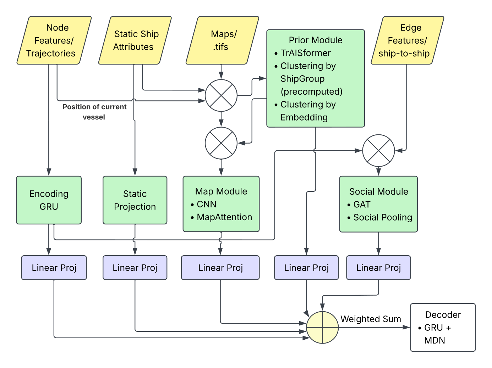
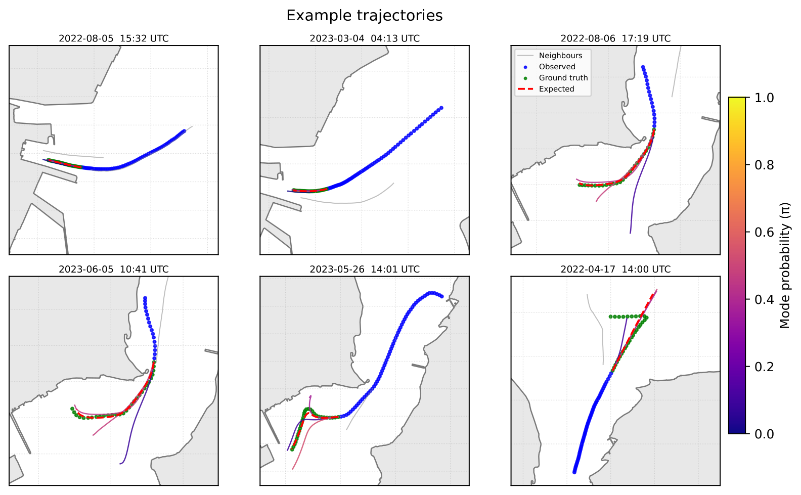
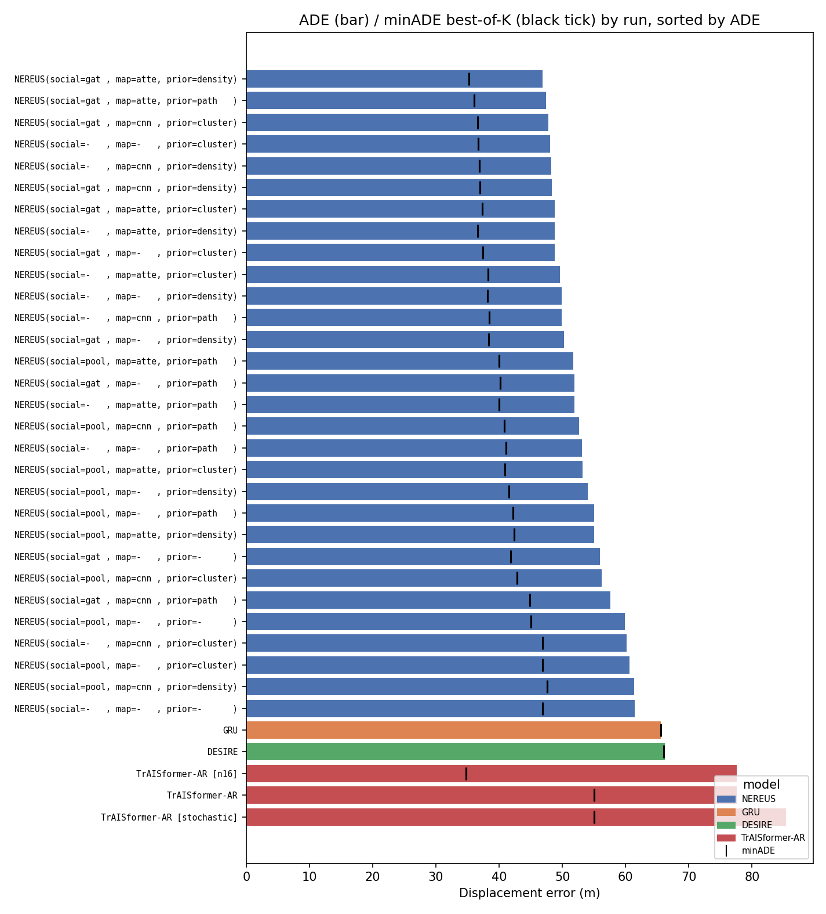
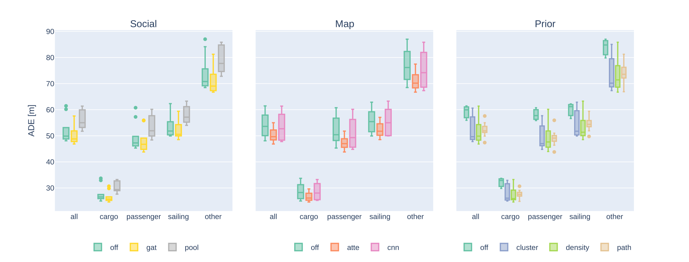
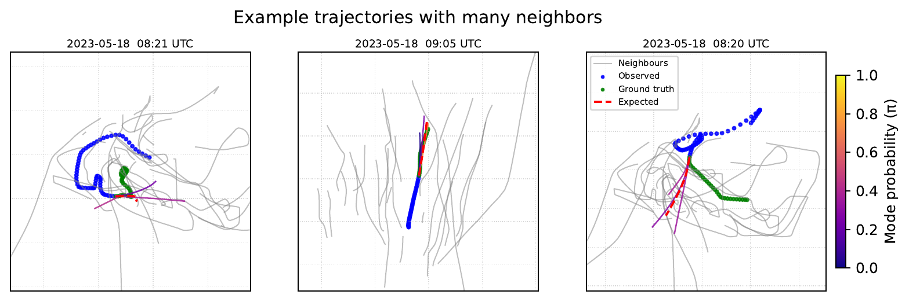

<h1 align="center">NEREUS</h1>

<p align="center">
  <strong>A Modular Probabilistic Framework for Context-Aware Ship Trajectory Forecasting</strong>
</p>

<p align="center">
  
  
  <a href="LICENSE"></a>
</p>

<p align="center">
  <b>N</b>autical <b>E</b>nvironment-aware <b>R</b>oute <b>E</b>stimation
  <b>U</b>nder uncertainty for <b>S</b>urface vessels
</p>

NEREUS is a modular, multi-modal framework for short-term vessel trajectory
forecasting. It combines motion history, static vessel properties,
vessel-to-vessel interaction, navigational-chart context, and route priors in a
shared latent representation, then predicts multiple plausible futures with an
autoregressive mixture-density decoder.

This repository accompanies the paper accepted at the **19th International
Conference on Multi-disciplinary Trends in Artificial Intelligence (MIWAI 2026)**.

<p align="center">
  
</p>

## Contents

- [Highlights](#highlights)
- [Architecture](#architecture)
- [Results](#results)
- [Data](#data)
- [Installation](#installation)
- [Training](#training)
- [Evaluation and reproduction](#evaluation-and-reproduction)
- [Repository structure](#repository-structure)
- [Scope and limitations](#scope-and-limitations)
- [Acknowledgements and license](#acknowledgements-and-license)
- [Citation](#citation)

## Highlights

- **Unified context modelling:** combines trajectory, vessel, social, map, and
  route-prior information within one forecasting architecture.
- **Modular design:** evaluates 30 combinations of social, map, and prior
  components under a common training protocol.
- **Multi-modal forecasts:** returns three learned trajectory modes and their
  probabilities, in addition to the probability-weighted forecast.
- **Operational horizon:** observes 10 minutes of AIS history and forecasts the
  following 5 minutes at 10-second intervals.
- **Strong primary-error performance:** the best NEREUS configuration achieves
  the lowest ADE and FDE at 1, 3, and 5 minutes among the evaluated models.
- **Transparent evidence:** aggregate tables, per-run metrics, training curves,
  efficiency measurements, and reproduction commands are included.

## Architecture

NEREUS follows an **encode–fuse–decode** design. Every active stream is projected
to a 256-dimensional latent space and combined by a learnable softmax-weighted
sum before decoding.

| Stream | Input | Role |
|---|---|---|
| Trajectory | Relative position, speed, acceleration, course, turn rate | Encodes recent vessel motion with a GRU |
| Static vessel | Ship type and hull geometry | Conditions the forecast on vessel characteristics |
| Social | Pairwise encounter features within 500 m | Models nearby traffic with GAT or social pooling |
| Map | Four navigational-chart layers | Encodes local geographic constraints with CNN or attention |
| Prior | Density, path heat map, or GMM cluster mixture | Supplies longer-term route context |

The reported best configuration uses a **graph-attention social module**, an
**attention-based map module**, and a **ship-type density prior**. Complete input
feature definitions and module hyperparameters are recorded in
[`results/summary.md`](results/summary.md).

## Results

All values below are in metres on the Kiel Fjord test set. ADE/minADE cover the
complete five-minute horizon; FDE/minFDE are evaluated at the indicated forecast
time. NEREUS reports a probability-weighted single forecast and three
mixture-mode trajectories for best-of-K evaluation.

| Model | ADE ↓ | minADE ↓ | FDE@1 min ↓ | minFDE@1 min ↓ | FDE@3 min ↓ | minFDE@3 min ↓ | FDE@5 min ↓ | minFDE@5 min ↓ |
|---|---:|---:|---:|---:|---:|---:|---:|---:|
| GRU | 65.54 | 65.54 | 16.73 | 16.73 | 78.87 | 78.87 | 160.87 | 160.87 |
| DESIRE | 66.22 | 66.00 | 17.05 | 16.94 | 80.02 | 79.73 | 160.18 | 159.58 |
| TrAISformer-AR (K=4) | 77.55 | 55.07 | 23.29 | 18.03 | 91.20 | 61.34 | 187.01 | 116.28 |
| TrAISformer-AR (K=16) | 77.55 | **34.73** | 23.29 | 12.42 | 91.20 | **32.87** | 187.00 | **60.24** |
| NEREUS without optional modules | 61.45 | 46.88 | 13.67 | 10.76 | 74.22 | 54.08 | 154.56 | 109.16 |
| **NEREUS (best)** | **46.85** | 35.26 | **11.15** | **8.26** | **56.03** | 39.84 | **118.58** | 82.35 |

Compared with standalone TrAISformer-AR, the best NEREUS configuration reduces
ADE by **39.59%** and five-minute FDE by **36.59%**. TrAISformer-AR obtains the
lowest best-of-16 errors, but those metrics assume an oracle that selects the
trajectory closest to the ground truth. For this reason, the paper treats
single-forecast ADE/FDE as the primary metrics and best-of-K results as an upper
bound on multi-modal performance.

<p align="center">
  
</p>

<p align="center"><em>Representative test-set forecasts. Colour encodes mode probability.</em></p>

<table>
  <tr>
    <td width="50%"></td>
    <td width="50%"></td>
  </tr>
  <tr>
    <td align="center"><em>ADE/minADE across headline models</em></td>
    <td align="center"><em>Module effects by vessel group</em></td>
  </tr>
</table>

### Efficiency

Inference was measured on GPU with batch size 32 after 10 warm-up passes and 50
timed passes.

| Model | Parameters | GFLOPs (batch 32) | Inference (ms, batch 32) | Inference (ms/sample) | Training steps | Training time |
|---|---:|---:|---:|---:|---:|---:|
| GRU | 0.47 M | 1.16 | 8.67 | 0.271 | 42,199 | 1.27 h |
| DESIRE | 3.76 M | 25.32 | 23.38 | 0.731 | 61,799 | 2.80 h |
| TrAISformer-AR | 3.64 M | 82.41 | 51.26 | 1.602 | 191,349 | 3.18 h |
| NEREUS without optional modules | 0.48 M | 1.88 | 7.86 | 0.246 | 67,499 | 1.88 h |
| **NEREUS (best)** | **0.79 M** | **3.95** | **11.74** | **0.367** | **132,249** | **4.20 h** |

The corresponding measurements for all 30 NEREUS configurations and the three
headline baselines are retained in `results/model_stats_all.csv`. Every model was
trained with the same 10-hour maximum wall-clock budget and early stopping. None
of the five headline configurations reached the time limit; nine social-pooling
ablation runs did, and their validation losses were still decreasing at cutoff.

### Interpreting the multi-modal results

TrAISformer-AR's ADE/FDE columns use greedy decoding for the single reported
trajectory, corresponding to the original paper's non-stochastic ablation. Its
minADE/minFDE columns instead select the closest trajectory from multiple
stochastic rollouts. The K=16 row therefore demonstrates the architecture's
multi-modal coverage, but not an online trajectory-selection mechanism.

The implemented TrAISformer-AR loss sums the cross-entropies for position, SOG,
and COG at the trained resolution. It does not include the additional
three-times-coarser cross-entropy term described in the original TrAISformer
paper. Both the decoding comparison and this implementation difference are
recorded in [`results/METHODOLOGY.md`](results/METHODOLOGY.md) and
[`results/traisformer_ar_decoding.csv`](results/traisformer_ar_decoding.csv).

### Ablation evidence

The route prior provides the largest and most consistent contribution. Across
module combinations, disabling it gives a mean ADE of 59.1 m, while density,
path, and cluster priors reduce the mean to 51.4 m, 52.4 m, and 52.6 m,
respectively. The full 30-configuration comparison, including per-run TCPA,
DCPA, collision-risk, hyperparameter, and training-budget records, remains in
[`results/summary.md`](results/summary.md).

Detailed results are available in:

- [`results/paper_table.csv`](results/paper_table.csv): camera-ready comparison.
- [`results/summary.md`](results/summary.md): all model and ablation results.
- [`results/model_stats_all.csv`](results/model_stats_all.csv): size, compute,
  latency, and training cost for all 33 evaluated checkpoints.
- [`results/METHODOLOGY.md`](results/METHODOLOGY.md): metric definitions and
  evaluation decisions.

### Dense-traffic behaviour

<p align="center">
  
</p>

These examples are drawn from the busiest hour of 18 May 2023, a public holiday
with many sailing vessels following irregular, wind-driven paths. They expose a
current limitation: motion that departs from the approximately constant-heading
behaviour represented by most modes remains difficult to predict. The examples
are qualitative and are not collision-safety validation.

## Data

The experiments use AIS trajectories from the Kiel Fjord. Raw AIS data cannot be
redistributed; preprocessing is provided separately in the
[`ais-processing-26miwai`](https://github.com/CAPTN-sh/ais-processing-26miwai)
repository.

The split is performed at **calendar-day level** with a fixed seed, preventing a
trajectory from crossing between splits. It is not vessel-disjoint: the same
physical vessel may appear on different days in more than one split.

| Split | Unique vessels (MMSI) | Voyages |
|---|---:|---:|
| Train | 7,429 | 91,671 |
| Validation | 2,665 | 13,369 |
| Test | 4,053 | 23,356 |
| **Union** | **8,264** | **128,396** |

A voyage is a per-day `(MMSI, traj_id)` segment. Consequently, a physical voyage
that crosses midnight is represented by more than one segment.

## Installation

NEREUS requires Python 3.11 or 3.12 and uses
[`uv`](https://docs.astral.sh/uv/) for environment management.

```bash
git clone git@github.com:CAPTN-sh/nereus-26miwai.git
cd nereus-26miwai
uv sync
uv pip install torch-scatter \
  -f https://data.pyg.org/whl/torch-2.11.0%2Bcu130.html
```

Dataset and map paths are configured in [`src/utils/config.py`](src/utils/config.py).

## Training

```bash
# Prerequisite for the GMM route prior
uv run python src/train/fit_gmm.py

# NEREUS: all 30 valid module combinations
uv run python src/train/train_yaml.py config/nereus_all.yaml

# Baselines
uv run python src/train/train_yaml.py config/train_gru.yaml
uv run python src/train/train_yaml.py config/train_desire.yaml
uv run python src/train/train_yaml.py config/train_traisformer_ar.yaml
```

All headline models use the same 10-hour maximum training budget and early
stopping. The committed `lightning_logs/` directories contain derived
hyperparameters, metrics, and loss curves. Final checkpoint publication is being
prepared separately; raw TensorBoard event files are intentionally excluded.

## Evaluation and reproduction

`src/eval/full_eval_nereus.py` is the canonical evaluation entry point. It
dispatches according to the model class stored in each Lightning checkpoint.

```bash
# Evaluate all checkpoints matched by each configuration
uv run python src/eval/full_eval_nereus.py config/eval_nereus.yaml
uv run python src/eval/full_eval_nereus.py config/eval_desire.yaml
uv run python src/eval/full_eval_nereus.py config/eval_traisformer_ar.yaml

# Evaluate one checkpoint directly
uv run python src/eval/full_eval_nereus.py \
  lightning_logs/baselines/version_4/best.ckpt --regions kiel
```

See [`results/REPRODUCE.md`](results/REPRODUCE.md) for the complete command
reference and experiment-to-configuration mapping.

## Repository structure

```text
src/
  models/            Model implementations
    nereus/          Modular NEREUS architecture and losses
    desire/          DESIRE baseline
    gru/             Deterministic GRU baseline
    traisformer/      Heat-map prior and autoregressive baseline
    isstgcnn/         Reference IS-STGCNN implementation
    gmm/              GMM route-prior utilities
  train/             YAML training, continuation, and tuning entry points
  eval/              Unified evaluation pipeline and trajectory metrics
  utils/             Shared configuration and logging
config/              Per-model training and evaluation configurations
figures/             Camera-ready architecture, forecast, and ablation figures
results/             Paper tables, plots, methodology, and reproduction notes
scripts/analysis/    Result aggregation and model/training statistics
lightning_logs/      Per-run hyperparameters, metrics, and loss curves
```

The evaluation pipeline dispatches all supported models through the same metric
implementation. `results/REPRODUCE.md` maps each experiment directory to the
configuration and command that generated it; `lightning_logs/` retains the
corresponding derived run records without bundling raw TensorBoard event files.

## Scope and limitations

- Results are reported for one geographic area and time period; geographic and
  temporal out-of-distribution transfer has not been evaluated.
- Best-of-K metrics require ground-truth-based mode selection and therefore do
  not represent an online selection strategy.
- Dense, irregular sailing traffic remains challenging.
- Collision-risk, TCPA, and DCPA measurements characterize predicted
  trajectories; they do not constitute closed-loop collision-avoidance or safety
  validation.
- IS-STGCNN results are retained for reference but excluded from the headline
  comparison because parts of its implementation could not be reproduced
  faithfully from the original publication.

## Acknowledgements and license

The DESIRE implementation is adapted from
[`AkashGanesan/desire-pytorch`](https://github.com/AkashGanesan/desire-pytorch),
and the TrAISformer implementation is adapted from
[`CIA-Oceanix/TrAISformer`](https://github.com/CIA-Oceanix/TrAISformer).

This research has been partly funded by the German Federal Ministry for Digital
and Transport within the project *CAPTN Förde Areal II – Praxisnahe Erforschung
der (teil)autonomen, emissionsfreien Schifffahrt im digitalen Testfeld*
(45DTWV08D).

The source code is released under the [MIT License](LICENSE). The raw AIS data is
not included and cannot be redistributed.

## Citation

If you use NEREUS or the accompanying results, please cite the paper. The entry
below is provisional and will be updated with the Springer volume, page range,
editors, and DOI when the MIWAI 2026 proceedings are published.

```bibtex
@inproceedings{alfalouji2026nereus,
  author    = {Al-Falouji, Ghassan and Spils, Michel and Biesenbach, Ben and Tomforde, Sven},
  title     = {{NEREUS}: A Modular Probabilistic Framework for Context-Aware Ship Trajectory Forecasting},
  booktitle = {Multi-disciplinary Trends in Artificial Intelligence},
  series    = {Lecture Notes in Artificial Intelligence},
  publisher = {Springer Nature Singapore},
  year      = {2026},
  note      = {To appear in the proceedings of the 19th International Conference on Multi-disciplinary Trends in Artificial Intelligence (MIWAI 2026)}
}
```
