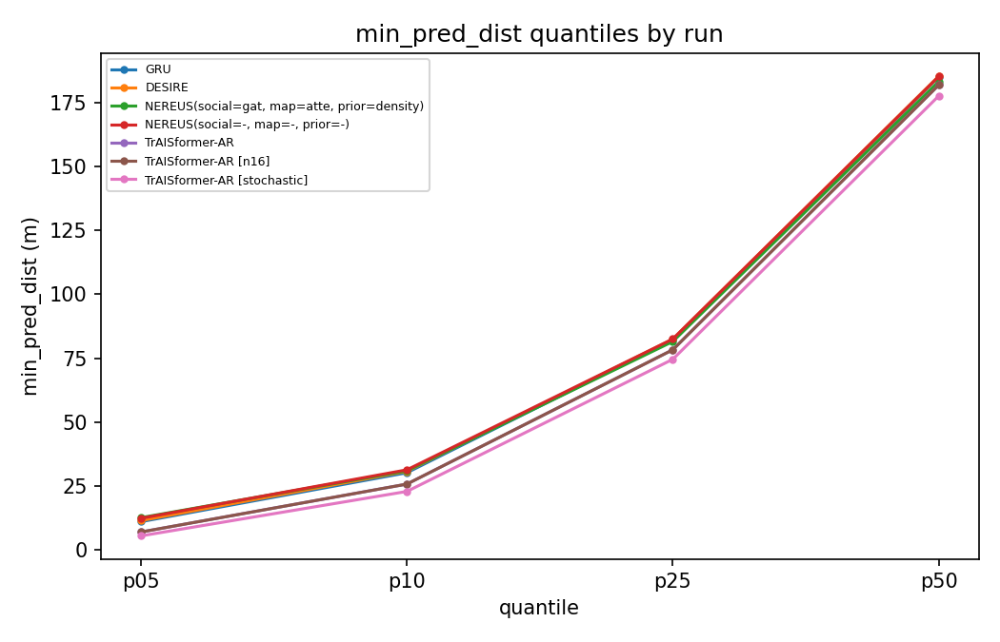

See METHODOLOGY.md for how these metrics are computed.

## Cross-model comparison

| run | model | ade | k_ade | pred_risk | min_pred_dist | dcpa_mean | tcpa_mean_s | collision_ratio | fde_1min | k_fde_1min | fde_3min | k_fde_3min | fde_5min | k_fde_5min |
|---|---|---|---|---|---|---|---|---|---|---|---|---|---|---|
| nereus_ablation/version_15 | NEREUS(social=gat, map=atte, prior=density) | 46.85 | 35.261 | 0.531 | 198.212 | 203.149 | 58.559 | 2.39 | 11.154 | 8.257 | 56.025 | 39.843 | 118.583 | 82.351 |
| nereus_ablation/version_16 | NEREUS(social=gat, map=atte, prior=path) | 47.395 | 36.091 | 0.531 | 198.356 | 203.23 | 58.583 | 2.412 | 11.347 | 8.46 | 56.711 | 40.887 | 119.728 | 84.147 |
| nereus_ablation/version_14 | NEREUS(social=gat, map=cnn, prior=cluster) | 47.788 | 36.591 | 0.531 | 198.324 | 203.183 | 58.532 | 2.419 | 11.453 | 8.658 | 57.287 | 41.546 | 120.213 | 84.895 |
| nereus_ablation/version_11 | NEREUS(social=-, map=-, prior=cluster) | 48.071 | 36.731 | 0.532 | 198.467 | 203.16 | 58.301 | 2.403 | 11.342 | 8.513 | 57.395 | 41.667 | 122.101 | 86.189 |
| nereus_ablation/version_24 | NEREUS(social=-, map=cnn, prior=density) | 48.23 | 36.876 | 0.532 | 198.234 | 203.19 | 58.373 | 2.454 | 11.667 | 8.849 | 57.909 | 41.826 | 120.612 | 85.38 |
| nereus_ablation/version_12 | NEREUS(social=gat, map=cnn, prior=density) | 48.354 | 36.926 | 0.531 | 198.385 | 203.206 | 58.412 | 2.423 | 11.563 | 8.739 | 57.997 | 41.92 | 121.511 | 85.628 |
| nereus_ablation/version_17 | NEREUS(social=gat, map=atte, prior=cluster) | 48.758 | 37.293 | 0.531 | 198.342 | 203.192 | 58.545 | 2.426 | 11.637 | 8.774 | 58.447 | 42.337 | 122.602 | 86.554 |
| nereus_ablation/version_27 | NEREUS(social=-, map=atte, prior=density) | 48.786 | 36.565 | 0.531 | 198.325 | 203.197 | 58.509 | 2.463 | 11.604 | 8.542 | 58.515 | 41.598 | 122.706 | 84.73 |
| nereus_ablation/version_3 | NEREUS(social=gat, map=-, prior=cluster) | 48.817 | 37.421 | 0.531 | 198.492 | 203.195 | 58.403 | 2.435 | 11.528 | 8.725 | 58.267 | 42.531 | 123.931 | 87.856 |
| nereus_ablation/version_29 | NEREUS(social=-, map=atte, prior=cluster) | 49.659 | 38.277 | 0.531 | 198.407 | 203.186 | 58.466 | 2.486 | 11.969 | 9.168 | 59.726 | 43.577 | 123.906 | 88.263 |
| nereus_ablation/version_9 | NEREUS(social=-, map=-, prior=density) | 49.871 | 38.14 | 0.531 | 198.497 | 203.216 | 58.353 | 2.446 | 11.867 | 9.06 | 59.852 | 43.493 | 125.168 | 88.531 |
| nereus_ablation/version_25 | NEREUS(social=-, map=cnn, prior=path) | 49.879 | 38.46 | 0.531 | 198.194 | 203.198 | 58.559 | 2.555 | 12.107 | 9.26 | 60.082 | 43.937 | 124.096 | 88.516 |
| nereus_ablation/version_1 | NEREUS(social=gat, map=-, prior=density) | 50.242 | 38.31 | 0.532 | 198.47 | 203.221 | 58.309 | 2.432 | 11.88 | 8.984 | 60.261 | 43.599 | 126.433 | 89.187 |
| nereus_ablation/version_22 | NEREUS(social=pool, map=atte, prior=path) | 51.75 | 40.024 | 0.531 | 198.387 | 203.265 | 58.383 | 2.522 | 12.441 | 9.653 | 62.522 | 45.817 | 128.175 | 91.533 |
| nereus_ablation/version_2 | NEREUS(social=gat, map=-, prior=path) | 51.876 | 40.155 | 0.532 | 198.913 | 203.304 | 58.242 | 2.462 | 12.311 | 9.391 | 62.236 | 45.857 | 130.391 | 93.39 |
| nereus_ablation/version_28 | NEREUS(social=-, map=atte, prior=path) | 51.902 | 39.988 | 0.531 | 198.256 | 203.241 | 58.482 | 2.543 | 12.535 | 9.629 | 62.694 | 45.661 | 128.474 | 91.572 |
| nereus_ablation/version_19 | NEREUS(social=pool, map=cnn, prior=path) | 52.69 | 40.808 | 0.531 | 198.363 | 203.251 | 58.419 | 2.539 | 12.795 | 9.825 | 63.807 | 46.572 | 129.931 | 93.182 |
| nereus_ablation/version_10 | NEREUS(social=-, map=-, prior=path) | 53.141 | 41.055 | 0.532 | 198.938 | 203.307 | 58.212 | 2.453 | 12.626 | 9.77 | 64.026 | 46.981 | 132.524 | 94.619 |
| nereus_ablation/version_23 | NEREUS(social=pool, map=atte, prior=cluster) | 53.188 | 40.878 | 0.531 | 198.163 | 203.184 | 58.534 | 2.601 | 12.678 | 9.794 | 64.589 | 46.939 | 130.85 | 92.986 |
| nereus_ablation/version_5 | NEREUS(social=pool, map=-, prior=density) | 54.052 | 41.572 | 0.532 | 198.643 | 203.283 | 58.16 | 2.482 | 12.855 | 9.905 | 65.396 | 47.84 | 133.735 | 95.415 |
| nereus_ablation/version_6 | NEREUS(social=pool, map=-, prior=path) | 54.99 | 42.239 | 0.531 | 198.876 | 203.274 | 58.456 | 2.517 | 12.841 | 9.979 | 66.622 | 48.555 | 136.487 | 97.026 |
| nereus_ablation/version_21 | NEREUS(social=pool, map=atte, prior=density) | 55.002 | 42.338 | 0.531 | 198.405 | 203.237 | 58.548 | 2.529 | 13.389 | 10.303 | 66.843 | 48.604 | 134.317 | 95.758 |
| nereus_ablation/version_0 | NEREUS(social=gat, map=-, prior=-) | 55.932 | 41.799 | 0.532 | 199.325 | 203.346 | 58.201 | 2.41 | 12.528 | 9.402 | 66.96 | 47.586 | 142.568 | 98.843 |
| nereus_ablation/version_20 | NEREUS(social=pool, map=cnn, prior=cluster) | 56.261 | 42.833 | 0.531 | 198.424 | 203.245 | 58.538 | 2.583 | 14.173 | 10.821 | 68.373 | 49.176 | 136.419 | 96.291 |
| nereus_ablation/version_13 | NEREUS(social=gat, map=cnn, prior=path) | 57.583 | 44.859 | 0.531 | 198.402 | 203.314 | 58.52 | 2.583 | 14.166 | 10.961 | 69.911 | 51.442 | 140.033 | 101.263 |
| nereus_ablation/version_4 | NEREUS(social=pool, map=-, prior=-) | 59.927 | 45.079 | 0.531 | 199.361 | 203.352 | 58.309 | 2.538 | 13.432 | 10.377 | 72.397 | 52.032 | 150.516 | 105.081 |
| nereus_ablation/version_26 | NEREUS(social=-, map=cnn, prior=cluster) | 60.162 | 46.825 | 0.531 | 198.383 | 203.247 | 58.379 | 2.642 | 16.093 | 12.336 | 73.056 | 53.638 | 143.087 | 103.603 |
| nereus_ablation/version_7 | NEREUS(social=pool, map=-, prior=cluster) | 60.603 | 46.895 | 0.531 | 198.638 | 203.283 | 58.365 | 2.692 | 15.813 | 12.161 | 73.463 | 53.859 | 145.407 | 104.807 |
| nereus_ablation/version_18 | NEREUS(social=pool, map=cnn, prior=density) | 61.368 | 47.6 | 0.531 | 198.469 | 203.281 | 58.375 | 2.667 | 16.405 | 12.664 | 74.474 | 54.652 | 145.944 | 104.617 |
| nereus_ablation/version_8 | NEREUS(social=-, map=-, prior=-) | 61.451 | 46.879 | 0.532 | 199.448 | 203.414 | 58.023 | 2.489 | 13.674 | 10.758 | 74.217 | 54.075 | 154.56 | 109.161 |
| baselines/version_4 | GRU | 65.536 | 65.536 | 0.532 | 199.114 | 203.211 | 57.635 | 2.73 | 16.733 | 16.733 | 78.868 | 78.868 | 160.868 | 160.868 |
| desire/version_0 | DESIRE | 66.219 | 65.996 | 0.532 | 199.478 | 203.295 | 57.456 | 2.674 | 17.049 | 16.94 | 80.024 | 79.726 | 160.176 | 159.583 |
| traisformer_ar/version_0 [n16] | TrAISformer-AR | 77.551 | 34.735 | 0.55 | 196.253 | 199.766 | 46.571 | 3.547 | 23.294 | 12.423 | 91.197 | 32.865 | 187.005 | 60.238 |
| traisformer_ar/version_0 | TrAISformer-AR | 77.551 | 55.065 | 0.55 | 196.253 | 199.766 | 46.571 | 3.547 | 23.294 | 18.028 | 91.197 | 61.338 | 187.005 | 116.284 |
| traisformer_ar/version_0 [stochastic] | TrAISformer-AR | 85.376 | 55.056 | 0.551 | 193.131 | 199.37 | 45.917 | 3.844 | 27.628 | 18.03 | 102.029 | 61.322 | 196.136 | 116.3 |

## Critical-encounter quantiles

p01/p05/.../p99 of the per-graph `min_pred_dist`, `dcpa`, and `tcpa_s` -- see METHODOLOGY.md. Only runs whose CSV has these columns are listed (regenerated after full_eval_nereus.py added CPA/TCPA/DCPA reporting).

| run | model | min_pred_dist_p01 | min_pred_dist_p05 | min_pred_dist_p10 | min_pred_dist_p25 | min_pred_dist_p50 | min_pred_dist_p75 | min_pred_dist_p90 | min_pred_dist_p95 | min_pred_dist_p99 | dcpa_p01 | dcpa_p05 | dcpa_p10 | dcpa_p25 | dcpa_p50 | dcpa_p75 | dcpa_p90 | dcpa_p95 | dcpa_p99 | tcpa_s_p01 | tcpa_s_p05 | tcpa_s_p10 | tcpa_s_p25 | tcpa_s_p50 | tcpa_s_p75 | tcpa_s_p90 | tcpa_s_p95 | tcpa_s_p99 |
|---|---|---|---|---|---|---|---|---|---|---|---|---|---|---|---|---|---|---|---|---|---|---|---|---|---|---|---|---|
| baselines/version_4 | GRU | 0.0 | 11.12 | 30.27 | 82.27 | 185.04 | 304.05 | 395.55 | 434.26 | 473.36 | 0.0 | 16.41 | 34.38 | 86.43 | 189.85 | 308.56 | 398.55 | 436.32 | 474.15 | 0.0 | 0.0 | 0.0 | 0.0 | 8.89 | 77.21 | 221.32 | 290.0 | 290.0 |
| desire/version_0 | DESIRE | 0.0 | 11.54 | 30.81 | 82.48 | 185.29 | 304.56 | 395.96 | 434.64 | 473.63 | 0.0 | 16.13 | 34.51 | 86.55 | 189.96 | 308.7 | 398.77 | 436.57 | 474.34 | 0.0 | 0.0 | 0.0 | 0.0 | 8.75 | 76.51 | 221.04 | 290.0 | 290.0 |
| nereus_ablation/version_0 | NEREUS(social=gat, map=-, prior=-) | 0.0 | 12.86 | 31.63 | 82.55 | 184.96 | 303.93 | 395.49 | 434.22 | 473.41 | 0.0 | 16.83 | 34.95 | 86.6 | 189.96 | 308.58 | 398.75 | 436.45 | 474.27 | 0.0 | 0.0 | 0.0 | 0.0 | 8.87 | 77.65 | 227.34 | 290.0 | 290.0 |
| nereus_ablation/version_1 | NEREUS(social=gat, map=-, prior=density) | 0.0 | 12.49 | 31.0 | 81.68 | 183.7 | 302.98 | 395.12 | 434.02 | 473.37 | 0.0 | 16.75 | 34.8 | 86.47 | 189.83 | 308.49 | 398.69 | 436.4 | 474.24 | 0.0 | 0.0 | 0.0 | 0.0 | 9.06 | 77.91 | 227.61 | 290.0 | 290.0 |
| nereus_ablation/version_10 | NEREUS(social=-, map=-, prior=path) | 0.0 | 12.53 | 31.19 | 82.3 | 184.36 | 303.45 | 395.33 | 434.15 | 473.38 | 0.0 | 16.88 | 34.87 | 86.6 | 189.92 | 308.52 | 398.73 | 436.48 | 474.25 | 0.0 | 0.0 | 0.0 | 0.0 | 8.92 | 77.72 | 227.17 | 290.0 | 290.0 |
| nereus_ablation/version_11 | NEREUS(social=-, map=-, prior=cluster) | 0.0 | 12.59 | 31.06 | 81.74 | 183.62 | 302.98 | 395.02 | 434.02 | 473.36 | 0.0 | 16.52 | 34.6 | 86.32 | 189.78 | 308.44 | 398.66 | 436.42 | 474.26 | 0.0 | 0.0 | 0.0 | 0.0 | 9.09 | 78.05 | 227.17 | 290.0 | 290.0 |
| nereus_ablation/version_12 | NEREUS(social=gat, map=cnn, prior=density) | 0.0 | 12.62 | 31.18 | 81.76 | 183.53 | 302.78 | 394.86 | 433.95 | 473.35 | 0.0 | 16.69 | 34.75 | 86.46 | 189.82 | 308.45 | 398.68 | 436.44 | 474.23 | 0.0 | 0.0 | 0.0 | 0.0 | 9.14 | 78.15 | 228.0 | 290.0 | 290.0 |
| nereus_ablation/version_13 | NEREUS(social=gat, map=cnn, prior=path) | 0.0 | 11.77 | 30.35 | 81.51 | 183.81 | 303.05 | 395.08 | 434.0 | 473.31 | 0.0 | 16.81 | 34.78 | 86.63 | 189.91 | 308.51 | 398.67 | 436.45 | 474.23 | 0.0 | 0.0 | 0.0 | 0.0 | 9.15 | 78.34 | 229.27 | 290.0 | 290.0 |
| nereus_ablation/version_14 | NEREUS(social=gat, map=cnn, prior=cluster) | 0.0 | 12.48 | 30.96 | 81.55 | 183.43 | 302.74 | 394.89 | 434.0 | 473.33 | 0.0 | 16.67 | 34.65 | 86.41 | 189.78 | 308.45 | 398.64 | 436.43 | 474.24 | 0.0 | 0.0 | 0.0 | 0.0 | 9.3 | 78.44 | 228.58 | 290.0 | 290.0 |
| nereus_ablation/version_15 | NEREUS(social=gat, map=atte, prior=density) | 0.0 | 12.69 | 31.02 | 81.56 | 183.24 | 302.62 | 394.84 | 433.86 | 473.3 | 0.0 | 16.58 | 34.62 | 86.38 | 189.7 | 308.41 | 398.63 | 436.37 | 474.22 | 0.0 | 0.0 | 0.0 | 0.0 | 9.26 | 78.47 | 228.9 | 290.0 | 290.0 |
| nereus_ablation/version_16 | NEREUS(social=gat, map=atte, prior=path) | 0.0 | 12.56 | 31.02 | 81.73 | 183.52 | 302.81 | 394.94 | 433.94 | 473.32 | 0.0 | 16.69 | 34.68 | 86.49 | 189.89 | 308.46 | 398.69 | 436.44 | 474.24 | 0.0 | 0.0 | 0.0 | 0.0 | 9.2 | 78.6 | 229.01 | 290.0 | 290.0 |
| nereus_ablation/version_17 | NEREUS(social=gat, map=atte, prior=cluster) | 0.0 | 12.53 | 31.1 | 81.62 | 183.49 | 302.78 | 394.97 | 433.93 | 473.34 | 0.0 | 16.69 | 34.78 | 86.42 | 189.8 | 308.4 | 398.67 | 436.41 | 474.22 | 0.0 | 0.0 | 0.0 | 0.0 | 9.24 | 78.43 | 228.7 | 290.0 | 290.0 |
| nereus_ablation/version_18 | NEREUS(social=pool, map=cnn, prior=density) | 0.0 | 11.5 | 30.36 | 81.59 | 183.81 | 303.19 | 395.16 | 434.16 | 473.43 | 0.0 | 16.51 | 34.66 | 86.54 | 189.92 | 308.54 | 398.7 | 436.54 | 474.26 | 0.0 | 0.0 | 0.0 | 0.0 | 9.06 | 78.08 | 228.01 | 290.0 | 290.0 |
| nereus_ablation/version_19 | NEREUS(social=pool, map=cnn, prior=path) | 0.0 | 12.08 | 30.72 | 81.62 | 183.61 | 302.88 | 395.03 | 434.0 | 473.34 | 0.0 | 16.71 | 34.77 | 86.55 | 189.86 | 308.49 | 398.67 | 436.4 | 474.19 | 0.0 | 0.0 | 0.0 | 0.0 | 9.09 | 78.15 | 228.36 | 290.0 | 290.0 |
| nereus_ablation/version_2 | NEREUS(social=gat, map=-, prior=path) | 0.0 | 12.43 | 31.11 | 82.31 | 184.38 | 303.43 | 395.27 | 434.07 | 473.35 | 0.0 | 16.86 | 34.88 | 86.54 | 189.91 | 308.5 | 398.71 | 436.42 | 474.21 | 0.0 | 0.0 | 0.0 | 0.0 | 9.01 | 77.8 | 227.17 | 290.0 | 290.0 |
| nereus_ablation/version_20 | NEREUS(social=pool, map=cnn, prior=cluster) | 0.0 | 11.72 | 30.4 | 81.57 | 183.83 | 303.03 | 395.09 | 434.08 | 473.39 | 0.0 | 16.58 | 34.68 | 86.44 | 189.84 | 308.52 | 398.69 | 436.5 | 474.3 | 0.0 | 0.0 | 0.0 | 0.0 | 9.13 | 78.35 | 229.33 | 290.0 | 290.0 |
| nereus_ablation/version_21 | NEREUS(social=pool, map=atte, prior=density) | 0.0 | 12.04 | 30.72 | 81.53 | 183.63 | 303.04 | 395.06 | 434.02 | 473.39 | 0.0 | 16.65 | 34.66 | 86.45 | 189.85 | 308.5 | 398.64 | 436.44 | 474.25 | 0.0 | 0.0 | 0.0 | 0.0 | 9.14 | 78.33 | 229.28 | 290.0 | 290.0 |
| nereus_ablation/version_22 | NEREUS(social=pool, map=atte, prior=path) | 0.0 | 12.06 | 30.75 | 81.65 | 183.64 | 302.82 | 394.98 | 433.98 | 473.4 | 0.0 | 16.78 | 34.76 | 86.56 | 189.88 | 308.48 | 398.71 | 436.45 | 474.28 | 0.0 | 0.0 | 0.0 | 0.0 | 9.09 | 78.0 | 228.38 | 290.0 | 290.0 |
| nereus_ablation/version_23 | NEREUS(social=pool, map=atte, prior=cluster) | 0.0 | 11.56 | 30.26 | 81.27 | 183.38 | 302.8 | 395.04 | 434.07 | 473.38 | 0.0 | 16.64 | 34.7 | 86.44 | 189.79 | 308.41 | 398.66 | 436.45 | 474.29 | 0.0 | 0.0 | 0.0 | 0.0 | 9.14 | 78.35 | 229.2 | 290.0 | 290.0 |
| nereus_ablation/version_24 | NEREUS(social=-, map=cnn, prior=density) | 0.0 | 12.5 | 31.02 | 81.56 | 183.25 | 302.64 | 394.88 | 433.96 | 473.34 | 0.0 | 16.64 | 34.67 | 86.38 | 189.81 | 308.44 | 398.68 | 436.43 | 474.24 | 0.0 | 0.0 | 0.0 | 0.0 | 9.07 | 78.11 | 227.81 | 290.0 | 290.0 |
| nereus_ablation/version_25 | NEREUS(social=-, map=cnn, prior=path) | 0.0 | 11.92 | 30.46 | 81.55 | 183.34 | 302.68 | 394.92 | 434.01 | 473.37 | 0.0 | 16.63 | 34.64 | 86.39 | 189.8 | 308.47 | 398.71 | 436.41 | 474.23 | 0.0 | 0.0 | 0.0 | 0.0 | 9.21 | 78.44 | 228.93 | 290.0 | 290.0 |
| nereus_ablation/version_26 | NEREUS(social=-, map=cnn, prior=cluster) | 0.0 | 11.46 | 30.22 | 81.5 | 183.73 | 303.05 | 395.23 | 434.15 | 473.5 | 0.0 | 16.49 | 34.54 | 86.48 | 189.87 | 308.52 | 398.76 | 436.52 | 474.31 | 0.0 | 0.0 | 0.0 | 0.0 | 9.19 | 78.09 | 227.85 | 290.0 | 290.0 |
| nereus_ablation/version_27 | NEREUS(social=-, map=atte, prior=density) | 0.0 | 12.32 | 30.91 | 81.57 | 183.45 | 302.8 | 394.96 | 433.97 | 473.37 | 0.0 | 16.53 | 34.56 | 86.45 | 189.8 | 308.48 | 398.68 | 436.46 | 474.27 | 0.0 | 0.0 | 0.0 | 0.0 | 9.28 | 78.34 | 228.78 | 290.0 | 290.0 |
| nereus_ablation/version_28 | NEREUS(social=-, map=atte, prior=path) | 0.0 | 11.89 | 30.58 | 81.46 | 183.57 | 302.73 | 395.03 | 433.96 | 473.32 | 0.0 | 16.76 | 34.73 | 86.53 | 189.82 | 308.5 | 398.64 | 436.42 | 474.21 | 0.0 | 0.0 | 0.0 | 0.0 | 9.15 | 78.37 | 228.42 | 290.0 | 290.0 |
| nereus_ablation/version_29 | NEREUS(social=-, map=atte, prior=cluster) | 0.0 | 12.32 | 30.81 | 81.73 | 183.59 | 302.93 | 395.05 | 434.01 | 473.36 | 0.0 | 16.63 | 34.61 | 86.4 | 189.84 | 308.42 | 398.65 | 436.4 | 474.22 | 0.0 | 0.0 | 0.0 | 0.0 | 9.19 | 78.29 | 228.26 | 290.0 | 290.0 |
| nereus_ablation/version_3 | NEREUS(social=gat, map=-, prior=cluster) | 0.0 | 12.53 | 30.95 | 81.7 | 183.76 | 303.01 | 395.01 | 434.1 | 473.38 | 0.0 | 16.69 | 34.72 | 86.44 | 189.76 | 308.44 | 398.68 | 436.43 | 474.27 | 0.0 | 0.0 | 0.0 | 0.0 | 9.14 | 78.11 | 228.15 | 290.0 | 290.0 |
| nereus_ablation/version_4 | NEREUS(social=pool, map=-, prior=-) | 0.0 | 12.14 | 31.13 | 82.68 | 185.17 | 304.03 | 395.6 | 434.38 | 473.49 | 0.0 | 16.61 | 34.72 | 86.68 | 189.97 | 308.61 | 398.79 | 436.53 | 474.28 | 0.0 | 0.0 | 0.0 | 0.0 | 9.02 | 77.81 | 227.84 | 290.0 | 290.0 |
| nereus_ablation/version_5 | NEREUS(social=pool, map=-, prior=density) | 0.0 | 12.28 | 30.89 | 81.78 | 183.95 | 303.25 | 395.23 | 434.15 | 473.47 | 0.0 | 16.8 | 34.91 | 86.58 | 189.81 | 308.49 | 398.72 | 436.5 | 474.32 | 0.0 | 0.0 | 0.0 | 0.0 | 8.92 | 77.55 | 227.16 | 290.0 | 290.0 |
| nereus_ablation/version_6 | NEREUS(social=pool, map=-, prior=path) | 0.0 | 12.22 | 30.92 | 82.17 | 184.34 | 303.5 | 395.3 | 434.16 | 473.4 | 0.0 | 16.73 | 34.76 | 86.57 | 189.94 | 308.49 | 398.69 | 436.46 | 474.26 | 0.0 | 0.0 | 0.0 | 0.0 | 9.11 | 78.12 | 228.64 | 290.0 | 290.0 |
| nereus_ablation/version_7 | NEREUS(social=pool, map=-, prior=cluster) | 0.0 | 11.35 | 30.42 | 81.77 | 184.06 | 303.45 | 395.33 | 434.25 | 473.42 | 0.0 | 16.52 | 34.67 | 86.58 | 189.92 | 308.55 | 398.72 | 436.52 | 474.28 | 0.0 | 0.0 | 0.0 | 0.0 | 9.08 | 78.04 | 227.87 | 290.0 | 290.0 |
| nereus_ablation/version_8 | NEREUS(social=-, map=-, prior=-) | 0.0 | 12.45 | 31.39 | 82.55 | 185.19 | 304.25 | 395.77 | 434.43 | 473.52 | 0.0 | 16.89 | 35.02 | 86.74 | 190.01 | 308.69 | 398.79 | 436.57 | 474.32 | 0.0 | 0.0 | 0.0 | 0.0 | 8.77 | 77.26 | 226.55 | 290.0 | 290.0 |
| nereus_ablation/version_9 | NEREUS(social=-, map=-, prior=density) | 0.0 | 12.43 | 31.02 | 81.75 | 183.69 | 302.97 | 395.06 | 434.1 | 473.38 | 0.0 | 16.64 | 34.63 | 86.43 | 189.78 | 308.48 | 398.71 | 436.44 | 474.26 | 0.0 | 0.0 | 0.0 | 0.0 | 9.13 | 78.03 | 227.7 | 290.0 | 290.0 |
| traisformer_ar/version_0 | TrAISformer-AR | 0.0 | 7.07 | 25.81 | 78.34 | 181.85 | 301.65 | 394.04 | 433.06 | 473.32 | 0.0 | 10.54 | 27.74 | 80.89 | 186.49 | 306.67 | 397.33 | 435.32 | 474.2 | 0.0 | 0.0 | 0.0 | 0.0 | 8.89 | 63.21 | 149.84 | 234.5 | 290.0 |
| traisformer_ar/version_0 [n16] | TrAISformer-AR | 0.0 | 7.07 | 25.81 | 78.34 | 181.85 | 301.65 | 394.04 | 433.06 | 473.32 | 0.0 | 10.54 | 27.74 | 80.89 | 186.49 | 306.67 | 397.33 | 435.32 | 474.2 | 0.0 | 0.0 | 0.0 | 0.0 | 8.89 | 63.21 | 149.84 | 234.5 | 290.0 |
| traisformer_ar/version_0 [stochastic] | TrAISformer-AR | 0.0 | 5.56 | 22.94 | 74.61 | 177.57 | 298.52 | 391.96 | 431.75 | 473.04 | 0.0 | 10.08 | 27.15 | 80.17 | 185.96 | 306.49 | 397.31 | 435.24 | 474.41 | 0.0 | 0.0 | 0.0 | 0.0 | 9.04 | 62.46 | 146.57 | 228.58 | 290.0 |

## Hyperparameters

One row per checkpoint (eval-time decoding variants like [stochastic]/[n16] share their base checkpoint's row -- those overrides aren't trained hyperparameters). One table per model family: different model types share almost no cfg.* fields, so a single combined table is mostly empty cells.

### GRU

| run | model | lr | weight_decay | warmup_batches | batches_per_eval | cfg.edge_feat_dim | cfg.gnn_hidden_size | cfg.gnn_n_head | cfg.map_cnn_in | cfg.map_cnn_out | cfg.map_radius | cfg.map_res | cfg.max_dist | cfg.mdn_modes | cfg.node_feat_dim | cfg.obs_len | cfg.pred_len | cfg.prior_cnn_out | cfg.prior_pred_scope | cfg.rnn_hidden_size | cfg.static_feat_dim |
|---|---|---|---|---|---|---|---|---|---|---|---|---|---|---|---|---|---|---|---|---|---|
| baselines/version_4 | GRU | 0.001 | 1e-05 | 1407 | 1407 | 25 | 64 | 4 | 4 | 128 | 500 | 50 | None | 3 | 8 | 60 | 30 | 128 | path | 256 | 8 |

### DESIRE

| run | model | lr | weight_decay | warmup_batches | batches_per_eval | cfg.hidden_size | cfg.in_channels | cfg.intermediate_size | cfg.latent_size | cfg.max_dist | cfg.num_refine_iters | cfg.num_rings | cfg.num_samples | cfg.num_wedges | cfg.obs_len | cfg.out_channels | cfg.pred_dim | cfg.pred_len | cfg.rmin |
|---|---|---|---|---|---|---|---|---|---|---|---|---|---|---|---|---|---|---|---|
| desire/version_0 | DESIRE | 0.0003 | 1e-05 | 1407.0 | 1407.0 | 256.0 | 4.0 | 128.0 | 16.0 | 500.0 | 2.0 | 6.0 | 3.0 | 6.0 | 60.0 | 16.0 | 2.0 | 30.0 | 5.0 |

### NEREUS

| run | model | lr | weight_decay | warmup_batches | batches_per_eval | cfg.edge_feat_dim | cfg.gnn_hidden_size | cfg.gnn_n_head | cfg.map_cnn_in | cfg.map_cnn_out | cfg.map_radius | cfg.map_res | cfg.max_dist | cfg.mdn_modes | cfg.node_feat_dim | cfg.obs_len | cfg.pred_len | cfg.prior_cnn_out | cfg.prior_pred_scope | cfg.rnn_hidden_size | cfg.static_feat_dim | nereus_modules.map | nereus_modules.prior | nereus_modules.social |
|---|---|---|---|---|---|---|---|---|---|---|---|---|---|---|---|---|---|---|---|---|---|---|---|---|
| nereus_ablation/version_0 | NEREUS(social=gat, map=-, prior=-) | 0.0003 | 1e-05 | 1407 | 1407 | 25 | 64 | 4 | 4 | 128 | 500 | 50 | 500 | 3 | 8 | 60 | 30 | 128 | path | 256 | 8 | None | None | gat |
| nereus_ablation/version_1 | NEREUS(social=gat, map=-, prior=density) | 0.0003 | 1e-05 | 1407 | 1407 | 25 | 64 | 4 | 4 | 128 | 500 | 50 | 500 | 3 | 8 | 60 | 30 | 128 | path | 256 | 8 | None | density | gat |
| nereus_ablation/version_10 | NEREUS(social=-, map=-, prior=path) | 0.0003 | 1e-05 | 1407 | 1407 | 25 | 64 | 4 | 4 | 128 | 500 | 50 | 500 | 3 | 8 | 60 | 30 | 128 | path | 256 | 8 | None | path | None |
| nereus_ablation/version_11 | NEREUS(social=-, map=-, prior=cluster) | 0.0003 | 1e-05 | 1407 | 1407 | 25 | 64 | 4 | 4 | 128 | 500 | 50 | 500 | 3 | 8 | 60 | 30 | 128 | path | 256 | 8 | None | cluster | None |
| nereus_ablation/version_12 | NEREUS(social=gat, map=cnn, prior=density) | 0.0003 | 1e-05 | 1407 | 1407 | 25 | 64 | 4 | 4 | 128 | 500 | 50 | 500 | 3 | 8 | 60 | 30 | 128 | path | 256 | 8 | cnn | density | gat |
| nereus_ablation/version_13 | NEREUS(social=gat, map=cnn, prior=path) | 0.0003 | 1e-05 | 1407 | 1407 | 25 | 64 | 4 | 4 | 128 | 500 | 50 | 500 | 3 | 8 | 60 | 30 | 128 | path | 256 | 8 | cnn | path | gat |
| nereus_ablation/version_14 | NEREUS(social=gat, map=cnn, prior=cluster) | 0.0003 | 1e-05 | 1407 | 1407 | 25 | 64 | 4 | 4 | 128 | 500 | 50 | 500 | 3 | 8 | 60 | 30 | 128 | path | 256 | 8 | cnn | cluster | gat |
| nereus_ablation/version_15 | NEREUS(social=gat, map=atte, prior=density) | 0.0003 | 1e-05 | 1407 | 1407 | 25 | 64 | 4 | 4 | 128 | 500 | 50 | 500 | 3 | 8 | 60 | 30 | 128 | path | 256 | 8 | atte | density | gat |
| nereus_ablation/version_16 | NEREUS(social=gat, map=atte, prior=path) | 0.0003 | 1e-05 | 1407 | 1407 | 25 | 64 | 4 | 4 | 128 | 500 | 50 | 500 | 3 | 8 | 60 | 30 | 128 | path | 256 | 8 | atte | path | gat |
| nereus_ablation/version_17 | NEREUS(social=gat, map=atte, prior=cluster) | 0.0003 | 1e-05 | 1407 | 1407 | 25 | 64 | 4 | 4 | 128 | 500 | 50 | 500 | 3 | 8 | 60 | 30 | 128 | path | 256 | 8 | atte | cluster | gat |
| nereus_ablation/version_18 | NEREUS(social=pool, map=cnn, prior=density) | 0.0003 | 1e-05 | 1407 | 1407 | 25 | 64 | 4 | 4 | 128 | 500 | 50 | 500 | 3 | 8 | 60 | 30 | 128 | path | 256 | 8 | cnn | density | pool |
| nereus_ablation/version_19 | NEREUS(social=pool, map=cnn, prior=path) | 0.0003 | 1e-05 | 1407 | 1407 | 25 | 64 | 4 | 4 | 128 | 500 | 50 | 500 | 3 | 8 | 60 | 30 | 128 | path | 256 | 8 | cnn | path | pool |
| nereus_ablation/version_2 | NEREUS(social=gat, map=-, prior=path) | 0.0003 | 1e-05 | 1407 | 1407 | 25 | 64 | 4 | 4 | 128 | 500 | 50 | 500 | 3 | 8 | 60 | 30 | 128 | path | 256 | 8 | None | path | gat |
| nereus_ablation/version_20 | NEREUS(social=pool, map=cnn, prior=cluster) | 0.0003 | 1e-05 | 1407 | 1407 | 25 | 64 | 4 | 4 | 128 | 500 | 50 | 500 | 3 | 8 | 60 | 30 | 128 | path | 256 | 8 | cnn | cluster | pool |
| nereus_ablation/version_21 | NEREUS(social=pool, map=atte, prior=density) | 0.0003 | 1e-05 | 1407 | 1407 | 25 | 64 | 4 | 4 | 128 | 500 | 50 | 500 | 3 | 8 | 60 | 30 | 128 | path | 256 | 8 | atte | density | pool |
| nereus_ablation/version_22 | NEREUS(social=pool, map=atte, prior=path) | 0.0003 | 1e-05 | 1407 | 1407 | 25 | 64 | 4 | 4 | 128 | 500 | 50 | 500 | 3 | 8 | 60 | 30 | 128 | path | 256 | 8 | atte | path | pool |
| nereus_ablation/version_23 | NEREUS(social=pool, map=atte, prior=cluster) | 0.0003 | 1e-05 | 1407 | 1407 | 25 | 64 | 4 | 4 | 128 | 500 | 50 | 500 | 3 | 8 | 60 | 30 | 128 | path | 256 | 8 | atte | cluster | pool |
| nereus_ablation/version_24 | NEREUS(social=-, map=cnn, prior=density) | 0.0003 | 1e-05 | 1407 | 1407 | 25 | 64 | 4 | 4 | 128 | 500 | 50 | 500 | 3 | 8 | 60 | 30 | 128 | path | 256 | 8 | cnn | density | None |
| nereus_ablation/version_25 | NEREUS(social=-, map=cnn, prior=path) | 0.0003 | 1e-05 | 1407 | 1407 | 25 | 64 | 4 | 4 | 128 | 500 | 50 | 500 | 3 | 8 | 60 | 30 | 128 | path | 256 | 8 | cnn | path | None |
| nereus_ablation/version_26 | NEREUS(social=-, map=cnn, prior=cluster) | 0.0003 | 1e-05 | 1407 | 1407 | 25 | 64 | 4 | 4 | 128 | 500 | 50 | 500 | 3 | 8 | 60 | 30 | 128 | path | 256 | 8 | cnn | cluster | None |
| nereus_ablation/version_27 | NEREUS(social=-, map=atte, prior=density) | 0.0003 | 1e-05 | 1407 | 1407 | 25 | 64 | 4 | 4 | 128 | 500 | 50 | 500 | 3 | 8 | 60 | 30 | 128 | path | 256 | 8 | atte | density | None |
| nereus_ablation/version_28 | NEREUS(social=-, map=atte, prior=path) | 0.0003 | 1e-05 | 1407 | 1407 | 25 | 64 | 4 | 4 | 128 | 500 | 50 | 500 | 3 | 8 | 60 | 30 | 128 | path | 256 | 8 | atte | path | None |
| nereus_ablation/version_29 | NEREUS(social=-, map=atte, prior=cluster) | 0.0003 | 1e-05 | 1407 | 1407 | 25 | 64 | 4 | 4 | 128 | 500 | 50 | 500 | 3 | 8 | 60 | 30 | 128 | path | 256 | 8 | atte | cluster | None |
| nereus_ablation/version_3 | NEREUS(social=gat, map=-, prior=cluster) | 0.0003 | 1e-05 | 1407 | 1407 | 25 | 64 | 4 | 4 | 128 | 500 | 50 | 500 | 3 | 8 | 60 | 30 | 128 | path | 256 | 8 | None | cluster | gat |
| nereus_ablation/version_4 | NEREUS(social=pool, map=-, prior=-) | 0.0003 | 1e-05 | 1407 | 1407 | 25 | 64 | 4 | 4 | 128 | 500 | 50 | 500 | 3 | 8 | 60 | 30 | 128 | path | 256 | 8 | None | None | pool |
| nereus_ablation/version_5 | NEREUS(social=pool, map=-, prior=density) | 0.0003 | 1e-05 | 1407 | 1407 | 25 | 64 | 4 | 4 | 128 | 500 | 50 | 500 | 3 | 8 | 60 | 30 | 128 | path | 256 | 8 | None | density | pool |
| nereus_ablation/version_6 | NEREUS(social=pool, map=-, prior=path) | 0.0003 | 1e-05 | 1407 | 1407 | 25 | 64 | 4 | 4 | 128 | 500 | 50 | 500 | 3 | 8 | 60 | 30 | 128 | path | 256 | 8 | None | path | pool |
| nereus_ablation/version_7 | NEREUS(social=pool, map=-, prior=cluster) | 0.0003 | 1e-05 | 1407 | 1407 | 25 | 64 | 4 | 4 | 128 | 500 | 50 | 500 | 3 | 8 | 60 | 30 | 128 | path | 256 | 8 | None | cluster | pool |
| nereus_ablation/version_8 | NEREUS(social=-, map=-, prior=-) | 0.0003 | 1e-05 | 1407 | 1407 | 25 | 64 | 4 | 4 | 128 | 500 | 50 | 500 | 3 | 8 | 60 | 30 | 128 | path | 256 | 8 | None | None | None |
| nereus_ablation/version_9 | NEREUS(social=-, map=-, prior=density) | 0.0003 | 1e-05 | 1407 | 1407 | 25 | 64 | 4 | 4 | 128 | 500 | 50 | 500 | 3 | 8 | 60 | 30 | 128 | path | 256 | 8 | None | density | None |

### TrAISformer-AR

| run | model | lr | weight_decay | warmup_batches | batches_per_eval | cfg.attn_dropout | cfg.dropout | cfg.max_dist | cfg.n_cog_embd | cfg.n_embd | cfg.n_head | cfg.n_layer | cfg.n_sog_embd | cfg.n_x_embd | cfg.n_y_embd | cfg.num_samples | cfg.obs_len | cfg.pos_res | cfg.pred_len | cfg.r_vicinity | cfg.sample_mode | cfg.temperature | cfg.top_k |
|---|---|---|---|---|---|---|---|---|---|---|---|---|---|---|---|---|---|---|---|---|---|---|---|
| traisformer_ar/version_0 | TrAISformer-AR | 0.0006 | 1e-05 | 5628 | 5628 | 0.1 | 0.1 | 0 | 32 | 256 | 8 | 4 | 32 | 96 | 96 | 3 | 60 | 25 | 30 | 8 | vicinity | 1.0 | None |
